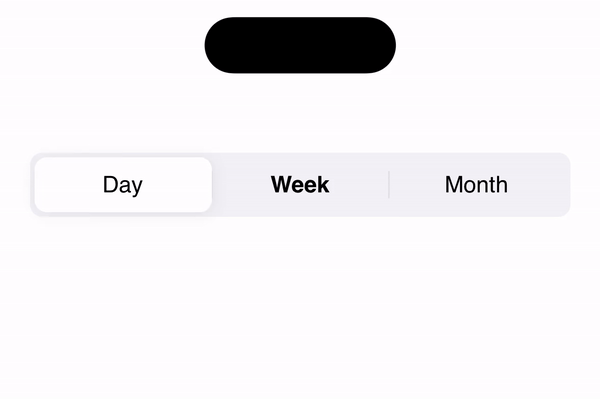
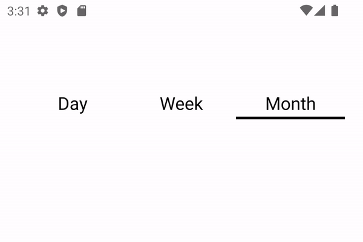

# rn-ui-segmented-control

Segmented Control for iOS and Tab Control for Android.





---

## Installation
```sh
npm install rn-ui-segmented-control

# -- OR -- #

yarn add rn-ui-segmented-control
```

## Usage

```ts
import { View } from 'react-native';
import { SegmentedControl } from 'rn-ui-segmented-control';

export default function App() {
  const handleOnIndexChange = (index: number, label: string) => {
    // ...
  }

  return (
      <View style={{flex: 1, flexDirection: 'row'}}>
        <SegmentedControl 
          labels={['Day', 'Week', 'Month']}
          style={{width: '90%', alignSelf: 'center'}}
          onIndexChange={handleOnIndexChange}
        />
      </View>
  );
}

```

## Use with ref (new ✨)

```ts
import { View, Text, Pressable } from 'react-native';
import { SegmentedControl } from 'rn-ui-segmented-control';

export default function App() {
  const ref = useRef<SegmentedControlRef>()
  const onPress = () => ref.current?.goToIndex(2)

  return (
      <View style={{flex: 1, flexDirection: 'row'}}>
        <SegmentedControl 
          labels={['Day', 'Week', 'Month']}
          style={{width: '90%', alignSelf: 'center'}}
          ref={ref}
        />

        <Pressable onPress={onPress}>
          <Text>{'Switch to tab 3'}</Text>
        </Pressable>
      </View>
  );
}

```

## Common Props
```ts
export interface SegmentedControlProps extends AccessibilityProps {
  labels: string[],
  onIndexChange?: (index: number, label: string) => void, // in 'single' mode
  onSelectionChange?: (selection: number[]) => void, // in 'multiple' mode
  renderSeparators?: boolean,
  selectedIndex?: number | number[] // Initial index...
  mode?: 'single' | 'multiple'
  hapticFeedback?: boolean

  style?: StyleProp<ViewStyle>
  segmentStyle?: StyleProp<ViewStyle>
  labelStyle?: StyleProp<TextStyle>
  activeSegmentStyle?: StyleProp<ViewStyle>
  activeLabelStyle?: StyleProp<TextStyle>
  separatorStyle?: StyleProp<ViewStyle>
}

export interface SegmentedControlRef {
  goToIndex(index: number): void
}
```

## iOS Specific Props
```ts
export interface SegmentedControlIOSProps extends SegmentedControlProps {
  buttonStyle?: StyleProp<ViewStyle> // Similar to activeSegmentStyle but only for the animated slider
  easing?: (x: number) => number
  animate?: boolean
}
```

## Android Specific Props
```ts
export interface SegmentedControlAndroidProps extends SegmentedControlProps {
  android_ripple?: PressableAndroidRippleConfig | null | undefined
}
```


## Contributing

See the [contributing guide](CONTRIBUTING.md) to learn how to contribute to the repository and the development workflow.

## License

MIT

---

Made with [create-react-native-library](https://github.com/callstack/react-native-builder-bob)
